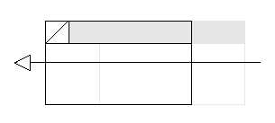
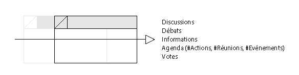
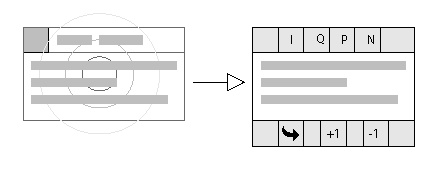
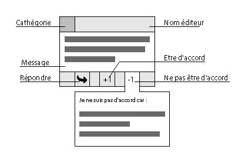

L'élément \<forum\>
===

La class abstraite `<forum>` doit permettre aux développeur d'UX d'accéder aux actions suivantes !

- Envoyer un message
- Répondre à un message
- Supprimer un message de son affichage. (N’impacte pas les autres)
- Catégorise les messages
- Indiquer être d'accord avec un message
- Indique ne pas être d'accord avec un message (impose un message réponse)

```ts
interface Forum extends HTMLDivElement
{
    public sendMessage(message, parent)
    public deleteMessage(msg)
    public tagMessage(msg, tag)
    public ImOk(message, reponse)
    public ImNotOk(message, reponse)
}
```

## L'UX

L'action *supprimer un message* ce fait en le glissant vers la gauche.



L'action *épingler un message* ce fait en le glissant vers la droite.



En sélectionnant un message, un menu apparait.



Sur menu les autres actions sont disponible.



### Aides

- Une lib ayant le composant swipe tout fait [framework7 Swipeout](http://framework7.io/docs/swipeout.html)
- Une lib plus légère [snabbt.js](http://daniel-lundin.github.io/snabbt.js/#transform-origin-example)

