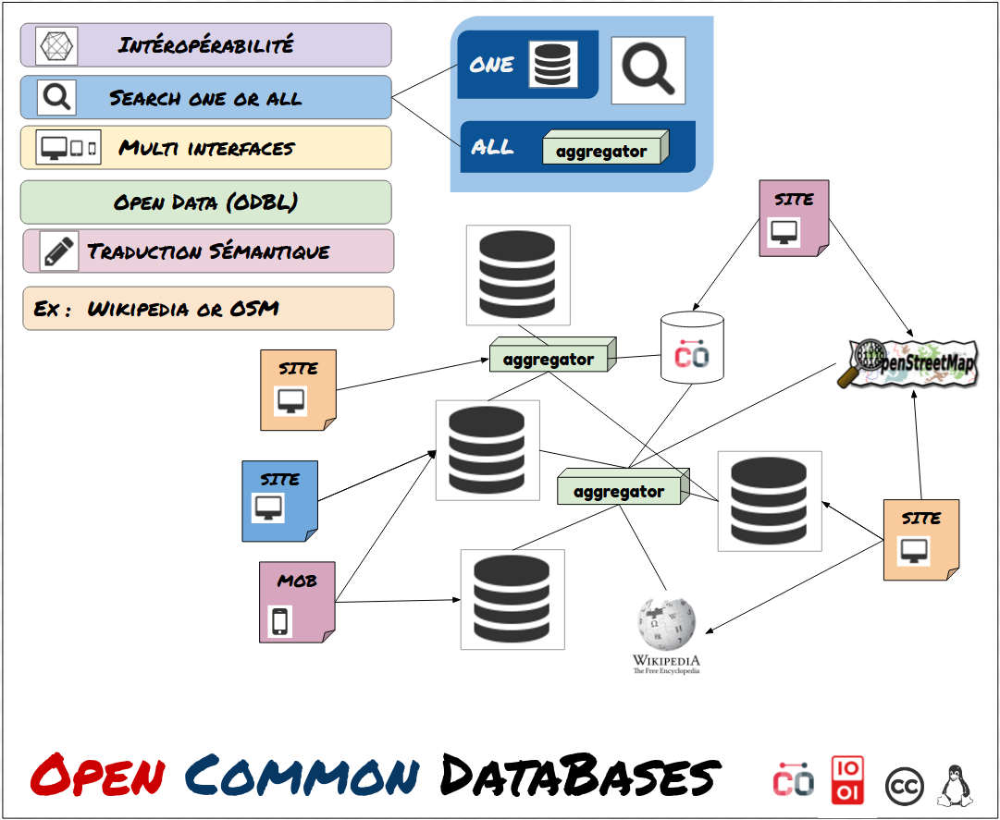

Les données / OpenDb
===

## Objectifs

- Décentraliser les données

  > Voir le groupe de réflexion [Réseaux Mesh & P2P](https://wiki.nuitdebout.fr/wiki/R%C3%A9seaux_Mesh_%26_P2P) sur la page [besoins utilisateurs: Stockage & Rangement](https://github.com/corbane/ND-Briques-Numeriques/wiki/A-2-Stockage-&-Rangement)
  
## Propositions

### Le projet OCDB de Communecter

> :grey_exclamation: Communecter ! vous pouvez expliquer et indiquer rapidement ici comment contribuer

### Utiliser une base de données graph neo4j

Avantages:

-	La flexibilité et le potentiel de liaison entre les données est celons moi l’outils rêvé (oui rêvé) pour notre problématique de classifications et recherche.

Inconvenants:

-	L’application gratuite ne permet pas des index uniques, cela impose de faire la vérification soit même
-	N’est pas une base de données décentraliser. Une solution serais de faire des réplicas.

Voir:

- [Introduction à neo4j](http://logisima.developpez.com/tutoriel/nosql/neo4j/introduction-neo4j/#LI-E-8)

(Jmv-archi sur racket chat)

### Un serveur de tuile générique

Implémenter de serveur de tuile (eg. OpenStreetMap) pour les agendas, forums, actions, projets, etc...

---
## Annexes

- [Article sur le p2p](http://schuler.developpez.com/articles/p2p/)
