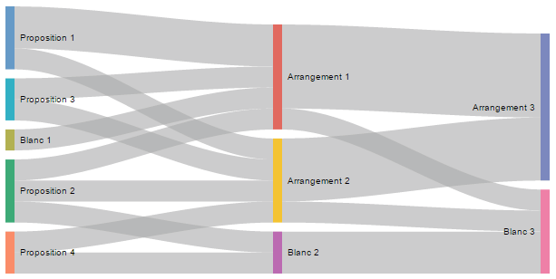

OpenUi - Les éléments débats
===

Ces propositions dépendent énormément du travail fait sur l'API [OpenDemocraticProcess](https://github.com/corbane/ND-Briques-Numeriques-api/tree/master/C-Processus%20d%C3%A9cisionnels/1-OpenDemocraticProcess)

### Description

Fournir des widgets, composant, etc, réutilisable pour l'affichage des vôtes et débats

### Propositions

- Composant de vue global d'avancement (pour des systèmes de construction vers un optique de consensus)

  - 

- Composant de visualisation des OpenDemocraticProcess (eg. flowgraph.js)

  - Cet exemple représente le processus de vote d'un consensus
    
    

  - Celui-ci par élimination des propositions par votes minoritaires
  
    