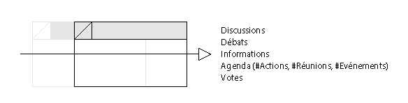
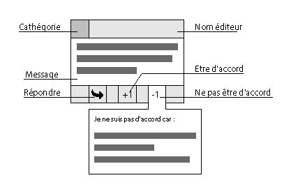

UX discussion & débats sur mobile
===

> ### :grey_exclamation: Ce document est encore un brouillons c’est donc une base de réflexion.

---
## L'interface

### Pour mobile

### Pour pc (tableau)

### Dissection de composants

&nbsp; | &nbsp;
------------ | -------------
 | [`propositions`](), [`proposition`](), [`grapheVote`]()

---
## L'interface Message

Proposition graphique de l'interface [`message`](../../1-OpenUi/discussion)

L'action *supprimer un message* se fait en le glissant vers la gauche.

L'action *épingler un message* se fait en le glissant vers la droite.

En sélectionnant un message, un menu apparait.

Sur ces menus les autres actions sont disponibles.

### Annexes

- Une lib ayant le composant swipe tout fait [framework7 Swipeout](http://framework7.io/docs/swipeout.html)
- Une lib plus légère [snabbt.js](http://daniel-lundin.github.io/snabbt.js/#transform-origin-example)

