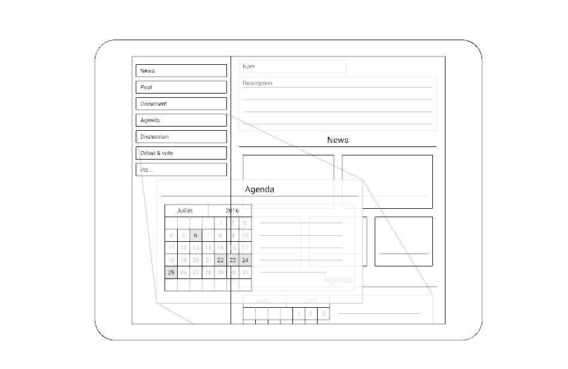

Editeur de page
===

## Objectifs

- Permettre aux plus néophytes de réaliser des pages, articles, documents,
  manuels, propositions, etc. de la manière la plus flexible possible en termes
  de présentation.  L’objectif n’est pas de créer un logiciel de traitement de
  texte ou de remplacer les site web des collectifs, participants etc, mais de
  permettre une présentation simple des annonces, projets, événements,
  propositions.

## Proposition

Permet de glisser des composants prédéfinis dans sa présentation en associant
des librairies telles que
[gridstack.js](http://troolee.github.io/gridstack.js/) et
[getcontenttools](http://getcontenttools.com/demo) Il sera possible de
structurer et éditer son texte de façon intuitive.
