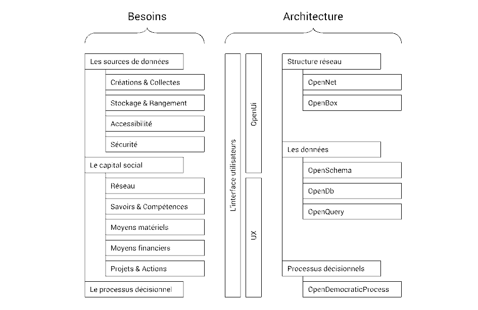

# ND-Briques-Numeriques

> Le document suivant est un cahier des charges fonctionnels sur la base d’une synthèse du hackathon réaliser le 25 et 26 juin 2016

## Pré-requis

Voici les liens des travaux effectués servant de base de réflexions à ce cahier des charges :

- Articles explicatif \
  [la Gazette Debout](http://gazettedebout.fr/2016/07/08/hackathondebout-geeks-de-nuit-debout-preparent-lavenir-mouvement/)

- Le hackathon E-Democratie \
  [Carte mentale générale](https://www.mindmeister.com/724254875/hackathondebout-e-democratie) \
  [Synthése de la carte mentale générale](https://www.mindmeister.com/721715693/hackathondebout-vue-d-ensemble) \
  [Les projets complémentaire](https://www.mindmeister.com/724295990/hackathondebout-projets-compl-mentaires)

- NuitDebout par [communecter.org](https://docs.google.com/document/d/1wZnQ6_0ak9YkXiglp1r5GNjxtrf6W6NP43wq2gvrkKg/mobilebasic)

## Philosophie

Donne-moi des briques et je construirais

Logiciel libre & open sources

[S’il vous plait adhérer à cette rigueur.](CRITIQUE.md)

---
## Objectifs

3 grand thèmes fonctionnel et sous modules sont ressortis du hackathon :

-	[Les sources de données](A-Sources de données)

  1) Créations & Collectes
  
  2) Stockage & Rangement
  
  3) Accessibilité
     
     > TODO module sécurité.

-	[Le capital social](B-Capital sociétale)

  1) Réseau
  
  2) Savoirs & Compétences
  
  3) Moyens matériels
  
  4) Moyens financiers
  
  5) Projets & Actions

-	[Le processus décisionnel](C-Processus décisionnels)

## Contraintes

- Il n'héxiste pas Une solution !   
  Mme Michou, le petit gaetan ou Marc l'ingé-son ne souhaite pas la même interface
  (**personisable**)

- Pour le 31 aout il nous faut lier les actifs entre eux et motiver l'envie de devenir actif.

Proposition
===

### Proposition sectorisé en briques

Voici la structure. L’arborescence « Besoins » correspond aux objectifs (ce Github) et « Architecture » correspond aux modules de travail ([cette autre Github](https://github.com/corbane/ND-Briques-Numeriques-api))

